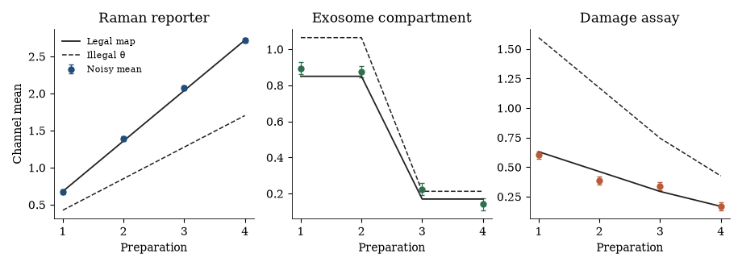
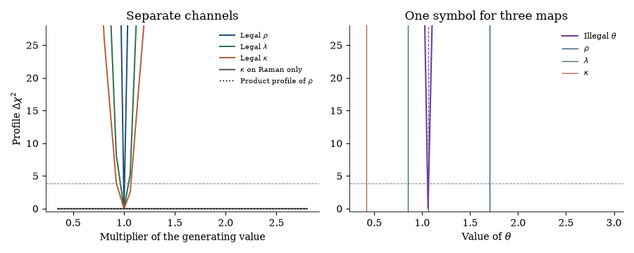
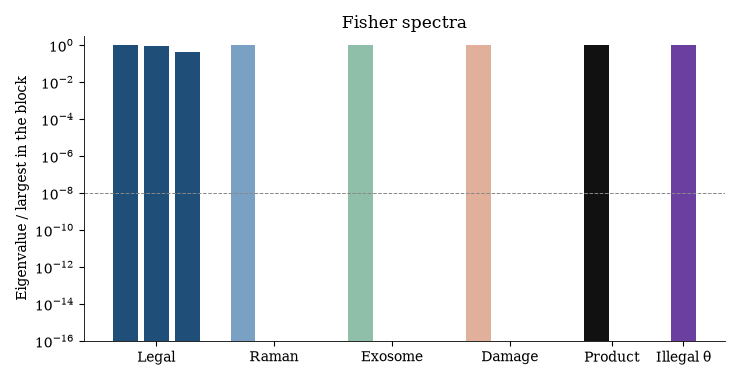

# Encoding a compartmental AgNP–exosome–Raman theranostic concept as a multi-observation Disease Profile research object

**Thesis #15. Computational research thesis** (series label R4)  
**Author:** Kelechi Emeka Ogbonna  
**Correspondence:** kelechiogbonna300@gmail.com · https://github.com/cloudynirvana/thesis-15-nanobiocomposite-multiobservation-profile  
**Date:** 21 September 2026  
**Format:** B.Sc. project chapters (Nile University style), written as a computational methods manuscript  
**Status:** In-silico encoding of a concept. Not a device. Not a fit to a spectrum or a cell assay.  
**Citation style:** numbered Vancouver. A `doi:` field appears only where Crossref returned the record on 21 September 2026.  
**DOI:** none for this document. Do not invent one.

---

## Title page

**ENCODING A COMPARTMENTAL AgNP–EXOSOME–RAMAN THERANOSTIC CONCEPT AS A MULTI-OBSERVATION DISEASE PROFILE RESEARCH OBJECT**

BY

**KELECHI EMEKA OGBONNA**

A COMPUTATIONAL RESEARCH THESIS  
(IN-SILICO RESEARCH-OBJECT STUDY)

SUBMITTED AS A CITEABLE MANUSCRIPT FOR JOURNAL / THESIS HANDOFF

PROJECT CONFLUENCE  
INDEPENDENT COMPUTATIONAL RESEARCH

SUPERVISOR: not appointed for this deposit

SEPTEMBER 2026

---

## Declaration

I, Kelechi Emeka Ogbonna, declare that this computational research thesis was carried out by me. The ranks, profiles, and validator outcomes reported here were produced by `sim/channel_profile.py` at seed 20260921. They are not wet-lab measurements and not patient outcomes. No DOI, ORCID, or journal acceptance was invented for this document.

_________________________     _______________________  
Kelechi Emeka Ogbonna         Date

---

## Abstract

Nanobiocomposite proposals often fuse photothermal/ROS, exosome delivery, and Raman sensing into one platform story; without named observation channels and refusal rules, those layers collapse into a single "nanotherapy works" claim. This thesis encodes that kind of concept as a Disease Profile with three observation channels and an empty therapeutic parameter list. The channels are a Raman reporter, an exosome compartment score, and a photothermal or ROS assay readout. Their map coefficients are ρ, λ, and κ. Schema version `1.1.0-multiobs` is a local extension of the Thesis #3 contract. A validator accepts the worked example and refuses a file that writes one symbol, θ, into all three channels.

On a four-preparation linear map the legal Fisher matrix has rank 3 of 3. Each channel alone has rank 1 of 3: the other two coefficients are invisible, and their profiles are flat. Forcing ρ = λ = κ = θ produces a scalar Fisher matrix of rank 1 of 1. The profile of θ closes. On noiseless data the estimate is θ̂ = 1.060, against generating values ρ = 1.70, λ = 0.85, and κ = 0.42. The same number sits 0.640 away from the damage coefficient. A product score m = ρ κ s c, the slogan in arithmetic, has rank 1 of 2. The profile of ρ is flat once κ is refit; a slice that freezes κ looks closed. Closure of the merged symbol is a property of the symbol that was written down.

The loadings are synthetic. Chapter Four is not a spectrum and not a cell assay. Research only. Not a medical device, not a dose, and not a cure.

---

## Keywords

Disease Profile; observation channel; silver nanoparticle; exosome; surface-enhanced Raman spectroscopy; theranostic concept; non-parameter; profile likelihood; research object; research only

---

## Table of Contents

DECLARATION  
ABSTRACT  
Table of Contents  
List of tables and figures  

CHAPTER ONE. INTRODUCTION  
1.1 Background to the study  
1.2 STATEMENT OF RESEARCH PROBLEM  
1.3 JUSTIFICATION OF STUDY  
1.4 AIM AND OBJECTIVES OF THE STUDY  
1.5 SIGNIFICANCE OF THE STUDY  
1.6 SCOPE OF THE STUDY  

CHAPTER TWO. LITERATURE REVIEW  
2.1 Plant-mediated silver as a materials literature  
2.2 Photothermal and ROS reports, and one particle with several jobs  
2.3 Exosomes as vesicles, carriers, and compartments  
2.4 Raman and SERS as a spectral channel  
2.5 Delivery fractions and the platform sentence  
2.6 Research objects already on the shelf  
2.7 What a closed profile actually answers  

CHAPTER THREE. MATERIALS AND METHODS  
3.1 Design  
3.2 The extended profile  
3.3 Three maps and the illegal scalar  
3.4 Fisher information  
3.5 Profiles and a product score  
3.6 Validator  
3.7 What was not done  

CHAPTER FOUR. RESULTS  
4.1 The legal object and the refused file  
4.2 Ranks  
4.3 Profiles of the separate coefficients  
4.4 The merged symbol is a weighted average  
4.5 The product score hides a hyperbola  

CHAPTER FIVE. DISCUSSION, CONCLUSION AND RECOMMENDATION  
5.1 Discussion  
5.2 Conclusion  
5.3 Recommendation  

REFERENCES  
DISCLAIMER  

---

## List of tables and figures

**Table 3-1.** Observation channels in the legal profile.  
**Table 3-2.** Generating map coefficients and preparation loadings.  
**Table 3-3.** Non-parameters required in the worked example.  
**Table 4-1.** Fisher ranks.  
**Table 4-2.** Profile calls on the scanned grids.  
**Table 4-3.** Noiseless illegal estimate against the three generating coefficients.  
**Table 4-4.** Refusal rules fired by the illegal file.

**Figure 4-1.** Channel means under the legal maps and under one θ.  
**Figure 4-2.** Profiles of the separate coefficients, and the profile of θ.  
**Figure 4-3.** Fisher spectra, each block scaled by its largest eigenvalue.

Figures are computational diagnostics from seed 20260921. They are not measured spectra or viability curves.

---

# CHAPTER ONE

## 1.0 INTRODUCTION

### 1.1 Background to the study

Chen and colleagues asked materials researchers to rethink cancer nanotheranostics as a genre that had been promising more than its measurements could carry [1]. The word itself was already in use. Lammers, Aime, Hennink, Storm and Kiessling described theranostic nanomedicine as a construct that would report and treat in the same object [2]. An earlier and cleaner experimental form is the gold nanorod paper of Huang, El-Sayed, Qian and El-Sayed: the rod is the near-infrared image and the source of heat [3]. Imaging and heating share a particle. They do not thereby share a parameter.

Silver made with plant extracts belongs to another shelf. Ahmed, Ahmad, Swami and Ikram reviewed that green route with antimicrobial use in view [4]. Iravani had already treated plant-mediated synthesis as a general method for metal particles [5]. Exosomes are not a reducing agent. Kalluri and LeBleu review them as vesicles with a cell biology and a long list of biomedical proposals [6]. Surface-enhanced Raman spectroscopy is a third shelf. Lane, Qian and Nie separate label-free detection from the use of a spectroscopic tag [7]. A platform paragraph that names all three shelves has not yet said which number came from which shelf.

Thesis #3 defined a Disease Profile as a versioned export for a disease class: identity, four laboratory questions, observables, candidate mechanisms, a list of non-parameters, admitted hypotheses, citations, and a fixed research boundary [8]. Wilkinson and colleagues had argued that scientific objects should be findable and reusable, which is a demand on the file, not a demand on a clinic [9]. The profile remembers a refusal. It does not remember a duty of care.

The contract in Thesis #3 does not yet require a spectroscopic channel to sit beside a damage-assay channel when the subject is a materials concept. A compartmental AgNP–exosome–Raman story can still leave the laboratory as one sentence. The sentence is what this thesis replaces with a file.

### 1.2 STATEMENT OF RESEARCH PROBLEM

Nanobiocomposite proposals often fuse photothermal/ROS, exosome delivery, and Raman sensing into one platform story; without named observation channels and refusal rules, those layers collapse into a single "nanotherapy works" claim. How can the concept be encoded as a Disease Profile, in the company of a CaseCard-style record, with explicit channels and non-parameters?

The working form is narrow. Three map coefficients generate three channels on four preparations. One file keeps the coefficients apart and leaves the therapeutic parameter list empty. Another file forces them into a single symbol θ. If the second file collapses the concept, the collapse has to show up as a rank, a profile, and a validator rule on this encoding.

A familiar way to miss the question is to watch the profile of θ close and announce that the platform has been identified. Closure answers the symbol that was written down. If the symbol was a merge, the closed curve describes the merge.

### 1.3 JUSTIFICATION OF STUDY

Named fields already changed what neighbouring literatures are allowed to imply. Faria and colleagues set out a minimum information standard for bio-nano experiments because too many papers left out the conditions a reader would need [10]. Théry and the MISEV2018 consortium required vesicle papers to say which characterisation had actually been done [11]. A channel list is the same kind of demand, moved onto a concept that likes to arrive pre-fused.

The statistical half of the justification is older than the materials. Raue and colleagues showed that a profile, which refits every other free parameter, is the confidence set one should look at, and that a slice with the others frozen can counterfeit that set [12]. Bellman and Åström defined structural identifiability as a property of a chosen input-output map [13]. Both results allow a sharp answer to a badly chosen symbol. The study is the demonstration on this concept: algebra of the three maps, Fisher rank, profiles, and a file that either contains the refusal or does not.

The study is justified as an encoding. It is not justified as a device, a laser protocol, or a dose.

### 1.4 AIM AND OBJECTIVES OF THE STUDY

The aim is to encode a compartmental AgNP–exosome–Raman concept as a multi-observation Disease Profile, and to show what happens to the likelihood when sensing and killing are forced into one parameter.

The objectives are:

i. Specify schema version `1.1.0-multiobs` as a local extension of the Thesis #3 Disease Profile, with three named channels and an empty therapeutic parameter list.  
ii. Publish a worked example in YAML and JSON that the validator accepts.  
iii. Publish the illegal merge as a second file, and record the rules it fails.  
iv. On a declared linear map, compare Fisher rank and profiles for the separate coefficients, for the scalar θ, and for a product score that multiplies the reporter gain by the damage coefficient.

### 1.5 SIGNIFICANCE OF THE STUDY

The result a later reader can use is a file format plus a numerical counterexample. A proposal that cannot name its channels cannot pass the validator. A proposal that names them, and then still quotes a single θ, can be shown the weighted average that θ actually is. That is a methods result for how a compartmental concept is stored. It is not an efficacy result for any particle.

### 1.6 SCOPE OF THE STUDY

The work is in silico. Loadings, noise, and the seed are declared in Chapter Three. There is no synthesis, no recorded spectrum, no animal, and no laser fluence.

Thesis #8 takes an α-amylase assay as a named observation channel for a metabolic question and keeps that assay out of a treatment parameter [14]. The maps in the present thesis do not enter a cancer ordinary differential equation, and they carry no amylase table. The 2022 Nile University project on *Carica papaya* leaf-extract silver nanoparticles is a separate wet-lab study [15]. Chapter Four does not re-tabulate it. A surface-plasmon peak of the kind that study recorded is listed among the non-parameters, because a peak that reports particles is not an efficacy.

---

# CHAPTER TWO

## 2.0 LITERATURE REVIEW

### 2.1 Plant-mediated silver as a materials literature

Sharma, Yngard and Lin reviewed silver nanoparticles through green synthesis and antimicrobial activity [16]. Mittal, Chisti and Banerjee treated plant extracts as reducing and capping agents for metal particles [17]. The observable those papers organise is a materials outcome: a colloid formed, a spectrum peaked, a microbial zone changed. Zhang, Liu, Shen and Gurunathan gathered synthesis, properties, and what the title calls therapeutic approaches into one review [18]. The title performs the fusion at bibliographic scale. Inside the review the measurements remain different operations.

Jeyaraj and colleagues published an experimental report of biogenic silver aimed at cancer cells [19]. It is an instance of that experimental genre. The viability numbers in it are not imported here, and they are not assigned to ρ, λ, or κ.

### 2.2 Photothermal and ROS reports, and one particle with several jobs

AshaRani, Low Kah Mun, Hande and Valiyaveettil measured cytotoxicity and genotoxicity of silver nanoparticles in human cells [20]. Carlson and colleagues reported a size dependence of reactive oxygen species in a macrophage-like line [21]. Both are assay papers. The number they return belongs to the assay that was run. Boca and colleagues coated triangular silver particles with chitosan and described them as photothermal transducers in an in-vitro cancer-cell experiment [22]. The emphasis is a thermal effect under illumination. Austin, Mackey, Dreaden and El-Sayed review optical, photothermal, and surface-chemical behaviour of gold and silver particles across biodiagnostics, therapy, and delivery [23]. The review is a map of properties. A map of properties is a poor place to invent one coefficient.

Albanese, Tang and Chan reviewed the effect of size, shape, and surface chemistry on biological systems [24]. Nel and colleagues argued that the nano-bio interface is a set of interactions [25]. Size can move a ROS assay and leave a Raman tag elsewhere. Shape can move a photothermal cross-section and leave a vesicle count alone. A concept that respects those papers has several readouts. A concept that respects them and then stores one θ has given the symbol several jobs.

### 2.3 Exosomes as vesicles, carriers, and compartments

van Niel, D'Angelo and Raposo review the cell biology of extracellular vesicles: biogenesis, cargo, and uptake [26]. EL Andaloussi, Mäger, Breakefield and Wood reviewed the therapeutic opportunities then being attached to vesicles [27]. Batrakova and Kim wrote about exosomes as carriers that arrive with delivery machinery [28]. A carrier sentence is a hypothesis about transport. It becomes a rate only after someone names the rate and shows that the data determine it. The profile in Chapter Three stores the sentence as knowledge and leaves the rate unwritten.

Yong and colleagues reported tumour-exosome-based nanoparticles as drug carriers in a chemotherapy experiment [29]. Sancho-Albero and colleagues encapsulated hollow gold nanoparticles in cell-derived exosomes and called the hybrids theranostic [30]. Both papers build a compartment in the materials sense: a particle associated with a vesicle. The channel used here is narrower than either paper's claim. It scores whether the concept places cargo in a medium compartment or a cell-associated compartment. Efficacy language from those studies stays outside Chapter Four.

### 2.4 Raman and SERS as a spectral channel

Zong and colleagues organised SERS bioanalysis around reliability: enhancement, assignment, and the ways a bright spectrum misleads [31]. Qian and colleagues demonstrated in vivo spectroscopic detection with SERS nanoparticle tags [32]. The recorded success is a spectrum at a location. Stremersch and colleagues identified individual exosome-like vesicles by SERS [33]. Shin and colleagues correlated cancerous exosomes with protein markers by SERS and principal-component analysis [34]. Across these papers the object in the notebook is spectral.

Boca's illuminated triangles return a thermal and cellular readout [22]. Stremersch's vesicles return a spectrum [33]. The two experiments can be narrated as one platform. The narration does not make the spectrum into the temperature. Section 3.3 writes them as different maps so that the difference can be counted.

### 2.5 Delivery fractions and the platform sentence

Wilhelm and colleagues pooled nanoparticle-delivery studies and reported a small median fraction of the injected dose in the tumour across that pool [35]. Lammers, Kiessling, Hennink and Storm listed principles and pitfalls of drug targeting, including the gap between a targeting story and a measured accumulation [36]. Park's 2019 note treated the surrounding hype as something that had begun to recede [37]. This thesis does not recompute those fractions. It uses the caution as a reason to ask for channels before accepting a platform sentence. A sentence can survive a literature in which the delivered fraction is small only by staying vague about which measurement it means.

### 2.6 Research objects already on the shelf

Bechhofer and colleagues argued that linked data, by themselves, do not give a working scientist a reusable object [38]. Thesis #3 built a Disease Profile for one laboratory's ontology: a schema, gates, and a non-parameter list [8]. Thesis #2's CaseCard is the companion habit in YAML. A card can hold a case, a list of observables, and qualitative constraints, and it is forbidden to turn a guideline touchpoint into a coefficient [39]. The file in this thesis sits with the Disease Profile. Channels are the addition. No pathway sketch is rerun, and no guideline is translated.

### 2.7 What a closed profile actually answers

Cobelli and DiStefano separated the structural question from the numerical trouble of a particular experiment [40]. Wieland and colleagues restated structural and practical identifiability for biological models [41]. The point carried into Chapter Three is limited. A rank and a closed profile describe the parameterisation that was written down [12,13]. When the written parameter is a merge of a spectrum and a damage assay, the sharp curve is a portrait of the merge.

---

# CHAPTER THREE

## 3.0 MATERIALS AND METHODS

### 3.1 Design

The preparations, the loadings, and the noise are a synthetic concept. No spectrum was downloaded, and no cell-assay file enters the likelihood.

The generator is fixed. Seed 20260921. Four preparations. Six replicates on each channel. Gaussian noise with standard deviation 0.08, independent across channels, preparations, and replicates. Software is `sim/channel_profile.py`. The steady maps are linear, so the Fisher matrices are analytic. Profiles use the same closed form.

Three coefficients generate the channels:

ρ = 1.70, &nbsp; λ = 0.85, &nbsp; κ = 0.42.

They are map coefficients of the toy. The legal profile's therapeutic parameter list is empty. Estimating ρ from the Raman channel shows that the channel carries a number. It does not admit ρ into a dose, a laser fluence, or a killing rate.

### 3.2 The extended profile

Schema version `1.1.0-multiobs` extends the Thesis #3 Disease Profile, schema `1.0.0` [8]. The extension is local to this repository. It does not edit the shipped contract. `schema/multiobservation_profile.schema.json` states the fields. The worked example is `profiles/agnp_exosome_raman.profile.yaml`, with a JSON twin written by the script.

Identity, the four questions, observables, candidate mechanisms, citations, and the disclaimer are retained from the parent object. The additions are `observation_channels` and an explicit `theta` list, which the legal file leaves empty. Each channel has an identifier, a symbol, a map-coefficient name, a sentence saying what it observes, the status `not_in_theta`, and a refusal sentence.

**Table 3-1.** Channels in the legal profile.

| Channel | Symbol | Map coefficient | What the channel records |
| --- | --- | --- | --- |
| `ch_sers` | yR | ρ | A declared spectral contrast |
| `ch_exosome` | yE | λ | Cargo scored as medium or cell-associated |
| `ch_damage` | yD | κ | A temperature or ROS assay number from a declared in-vitro setup |

The disease identifier is `solid-tumour-class-unspecified`. It names the class that platform stories usually gesture at. It does not name a person or a stage. The four answers record a methods researcher, that class, an in-vitro concept, and the stuck point: the three layers told as one story.

One candidate mechanism says the three symbols are different, and it carries a falsifier: a preparation series whose loadings differ and whose readouts nevertheless share one coefficient. A second candidate, `M-PLATFORM-WORKS`, says the platform works as nanotherapy. Its falsifier is empty and its status is `refused`. Admitted hypotheses carry `parameter_status: forbidden_to_enter_theta`.

Citations inside the file use DOI strings that were on the Crossref list checked for this deposit. A DOI that fails the pattern `10.` plus a registrant, or that is absent from that list, fails validation. The list is a snapshot of records consulted on 21 September 2026. It is not a claim that the snapshot is the whole literature.

### 3.3 Three maps and the illegal scalar

Preparation i has known loadings si, ei, and ci. The legal means are

yR,i = ρ si, &nbsp; yE,i = λ ei, &nbsp; yD,i = κ ci.

**Table 3-2.** Coefficients and loadings. Dimensionless concept units.

| Item | Values |
| --- | --- |
| ρ, λ, κ | 1.70, 0.85, 0.42 |
| s (reporter) | 0.40, 0.80, 1.20, 1.60 |
| e (compartment) | 1.00, 1.00, 0.20, 0.20 |
| c (damage assay) | 1.50, 1.10, 0.70, 0.40 |

The reporter loading rises across the four preparations. The damage loading falls. The compartment indicator is high on the first pair and low on the second. The three designs are different experiments sharing a page.

The illegal map uses one symbol for every channel:

yR,i = θ si, &nbsp; yE,i = θ ei, &nbsp; yD,i = θ ci.

On noiseless data the least-squares estimate is the design-weighted average of the three coefficients,

θ̂ = (ρ ‖s‖² + λ ‖e‖² + κ ‖c‖²) / (‖s‖² + ‖e‖² + ‖c‖²).

The weights are properties of the loadings. They move if the experiment moves. A killing mechanism that did not move would still be assigned a new θ̂.

A second illegal summary keeps only the product of sensing and killing. At the same loadings,

mi = ρ κ si ci.

Any pair (ρ, κ) with the same product π = ρκ writes the same m. The exosome coefficient λ does not enter m. The fused score has already dropped a channel.

### 3.4 Fisher information

Observations are Gaussian with known variance σ² = 0.08². With six replicates the legal Fisher matrix is diagonal. Its entries are

Fρρ = (n/σ²) ‖s‖², &nbsp; Fλλ = (n/σ²) ‖e‖², &nbsp; Fκκ = (n/σ²) ‖c‖².

Off-diagonal blocks are zero because each coefficient appears in only one channel. A single-channel analysis zeros the two unused diagonal entries. The illegal scalar has a one-by-one information equal to the sum of the three legal diagonals. Stacking channels under one symbol adds information about that symbol. It does not create information about the differences among ρ, λ, and κ.

For the product score the sensitivities ∂m/∂ρ and ∂m/∂κ are parallel: both are proportional to s c. The two-by-two Fisher matrix has rank 1. The null direction is proportional to (ρ, −κ), the local move that holds the product fixed.

Numerical rank counts eigenvalues above 10−8 times the largest eigenvalue of that block. Where a legal diagonal entry is positive, the reciprocal square root is reported as a local Cramér–Rao sketch under the Gaussian model. The sketch is not a posterior [40].

### 3.5 Profiles and a product score

A profile fixes one coefficient on a geometric grid and records the rise in weighted residual sum of squares above the least-squares minimum [12]. The grid runs from 0.35 to 2.8 times the reference value and includes the reference. The chi-square threshold for one interesting parameter is 3.841. A profile is called flat when the spread of Δχ² on the grid is below 0.5. It is called closed when both endpoints exceed the threshold. Otherwise it is called open.

For a legal coefficient the other channels do not enter the residual, so there is nothing to refit. The Raman-only profile of κ is the interesting contrast: κ does not appear in yR, the residual does not depend on it, and Δχ² is identically zero. The damage-only profile of ρ is the same fact in the other direction.

The product profile of ρ refits κ as π/ρ. On noiseless data the residual stays zero along that hyperbola. The slice freezes κ at 0.42 and moves ρ. The slice is reported because it is the plot that makes a fused score look identified [12].

Noiseless data equal the model mean. Noisy data are one draw at the seed above. One draw is not a sampling distribution of the profile.

### 3.6 Validator

`sim/channel_profile.py` loads both YAML files and the JSON twin. Each rule is recorded once per file. A legal file must extend Disease Profile schema `1.0.0`, answer the four questions, name the three channels, give each channel its own symbol and its own map coefficient, set every channel to `not_in_theta`, leave `theta` empty, include the non-parameter `merged_sensing_killing_theta`, refuse `M-PLATFORM-WORKS`, and keep every admitted hypothesis at `forbidden_to_enter_theta` with a non-empty falsifier. DOI fields must match the Crossref snapshot used for the file. The disclaimer string is fixed.

The illegal file is the same shell with the scientific damage done on purpose. All three channels share the symbol `theta_theranostic`, their status is `in_theta`, the theta list contains that symbol, the merge is absent from the non-parameter list, the admitted hypothesis says the symbol has entered θ, and `M-PLATFORM-WORKS` is marked admitted with an empty falsifier.

**Table 3-3.** Non-parameters required in the worked example.

| Identifier | What stays out of Θ |
| --- | --- |
| `merged_sensing_killing_theta` | One symbol used as reporter gain and as damage coefficient |
| `raman_peak_as_kill_coefficient` | A Raman peak height copied into a killing coefficient |
| `exosome_tropism_as_delivery_rate` | A tropism sentence written as a delivery rate |
| `spr_peak_as_anticancer_efficacy` | A plasmon peak from green synthesis treated as efficacy |
| `laser_fluence_or_infusion` | A fluence or an infusion |
| `theranostic_label` | The word theranostic used as a quantity |

### 3.7 What was not done

No particles were synthesised. The 2022 amylase table was not copied [15]. No tumour ordinary differential equation was integrated. Global-identifiability software was unnecessary: the maps are linear and the ranks are eigenvalues. Laser fluence, infusion rate, and body weight do not appear. The exosome channel is a compartment indicator in the concept, not a vesicle count from a cytometer. Papers cited in Chapter Two were not reanalysed. Their DOI strings were checked; their experiments were not repeated.

---

# CHAPTER FOUR

## 4.0 RESULTS

### 4.1 The legal object and the refused file

The validator accepts `profiles/agnp_exosome_raman.profile.yaml` and the JSON written from it. The example contains the six non-parameters in Table 3-3, the coefficient names ρ, λ, and κ, and an empty `theta` list. The illegal file fails eight rules. Table 4-4 lists them in the order the checker records. Acceptance is a property of the file. It is not a measurement of a particle.

### 4.2 Ranks

**Table 4-1.** Fisher rank under the declared noise model. Eigenvalues are analytic.

| Block | Parameters in the block | Rank | Eigenvalues |
| --- | --- | ---: | --- |
| Legal joint | ρ, λ, κ | 3 of 3 | 4500, 3853.125, 1950 |
| Raman only | ρ, λ, κ | 1 of 3 | 4500, 0, 0 |
| Exosome only | ρ, λ, κ | 1 of 3 | 1950, 0, 0 |
| Damage only | ρ, λ, κ | 1 of 3 | 3853.125, 0, 0 |
| Product score | ρ, κ | 1 of 2 | 6467.04, 0 |
| Illegal scalar | θ | 1 of 1 | 10303.125 |

The legal diagonals are full because each design has a positive squared norm: ‖s‖² = 4.80, ‖e‖² = 2.08, ‖c‖² = 4.11. The two zeros on a single-channel row are exact. A Raman series determines ρ and leaves λ and κ without a column. The illegal eigenvalue is the sum of the three legal diagonals, 4500 + 1950 + 3853.125. The merged symbol looks more precise than any honest channel because it has been allowed to spend every channel's information on one number.

Local relative Cramér–Rao sketches for the legal coefficients are 0.0088 for ρ, 0.027 for λ, and 0.038 for κ. Those fractions say the toy noise is small on this design. They do not say a laboratory SERS intensity has that precision.

**Figure 4-1.** Noisy means at seed 20260921, with the Gaussian standard error. The solid line is the legal map. The dashed line is the illegal fit of one θ to all three channels on that draw.

The dashed line cannot pass through all three panels. The reporter means rise. The damage means fall. One slope, copied onto three different loadings, misses both patterns. The legal lines follow the means because each line is allowed its own coefficient.

### 4.3 Profiles of the separate coefficients

**Table 4-2.** Calls on the scanned grids. Flat means the Δχ² spread is below 0.5. Closed means both endpoints exceed 3.841.

| Profile | Data | Call | Endpoint Δχ² |
| --- | --- | --- | --- |
| ρ, legal channel | noiseless | closed | 5.49×103, 4.21×104 |
| λ, legal channel | noiseless | closed | 595, 4.56×103 |
| κ, legal channel | noiseless | closed | 287, 2.20×103 |
| ρ, λ, κ | one noisy draw | closed | (same call) |
| κ using Raman only | noiseless | flat | 0, 0 |
| ρ using the damage channel only | noiseless | flat | 0, 0 |
| ρ on the product score, κ refit | noiseless | flat | 0, 0 |
| ρ on the product score, κ frozen | noiseless | closed | 454, 3.48×103 |
| θ, illegal scalar | noiseless | closed | 4.90×103, 3.75×104 |
| θ, illegal scalar | one noisy draw | closed | 4.93×103, 3.78×104 |

**Figure 4-2.** Left: Δχ² against a multiplier of the generating value. Legal profiles leave the 3.841 line immediately. The Raman-only profile of κ and the product profile of ρ stay on zero. Right: the illegal profile against the value of θ. Vertical lines mark θ̂ and the three generating coefficients. The vertical axis is clipped at 28 so the threshold can be seen; the endpoints are in Table 4-2.

The flat Raman-only curve is the encoding result in statistical form. Spectral data do not move κ. A damage assay does not move ρ. Anyone who reports a change in a Raman tag as a change in killing has used a channel to update a coefficient the channel does not contain.

### 4.4 The merged symbol is a weighted average

On noiseless data the illegal estimate is θ̂ = 1.0604. The weights are ‖s‖², ‖e‖², and ‖c‖² divided by their sum 10.99, that is 0.437, 0.189, and 0.374. The average is pulled hardest toward the reporter, because that design has the largest squared norm.

**Table 4-3.** Noiseless θ̂ against the generating coefficients.

| Coefficient | Generating value | θ̂ − value | Absolute error |
| --- | ---: | ---: | ---: |
| ρ | 1.70 | −0.640 | 0.640 |
| λ | 0.85 | +0.210 | 0.210 |
| κ | 0.42 | +0.640 | 0.640 |

θ̂ is 2.52 times the damage coefficient. The profile around it is closed, with endpoints in the tens of thousands of chi-square units. The one noisy draw moves the estimate only to 1.064 and leaves the call closed. Noise at this level does not rescue the symbol. The symbol was already the wrong average before the noise was added.

**Figure 4-3.** Eigenvalues divided by the largest eigenvalue of their own block. The dashed line is the relative rank tolerance, 10−8. Zeros are drawn at the floor of the axis. Single-channel blocks and the product block each keep a null direction. The illegal scalar has nothing left to be null: its only eigenvalue is normalised to one.

### 4.5 The product score hides a hyperbola

The product π = ρκ = 0.714. Along κ = π/ρ the fused score m is unchanged, and the profile Δχ² spread is 0. The slice that freezes κ at 0.42 treats a move in ρ as a move in the score. Both endpoints clear the threshold, at 454 and 3.48×103. The slice is the figure a platform paragraph draws when it multiplies a sensing claim by a killing claim and then varies only one of them.

The hyperbola is the set of stories the product cannot tell apart. A bright reporter with a weak damage coefficient, and a dim reporter with a strong one, write the same m if the products match. The legal channels separate those stories because the loadings s and c are not the same vector.

**Table 4-4.** Rules failed by `profiles/illegal_merged_theta.profile.yaml`. The legal file fails none.

| Rule | What the illegal file did |
| --- | --- |
| `channel_parameter_status` | Channel status set to `in_theta` |
| `symbol_not_unique` | One symbol on all three channels |
| `map_coefficient_not_unique` | One coefficient name on all three channels |
| `theta_not_empty` | `theta_theranostic` placed in Θ |
| `missing_non_parameter:merged_sensing_killing_theta` | The merge left off the refusal list |
| `hypothesis_parameter_status` | Admitted hypothesis marked `entered_theta` |
| `platform_claim_not_refused` | "The platform works" marked admitted |
| `candidate_admitted_without_falsifier` | That candidate has an empty falsifier |

The file fails before any fit is interpreted. A later worker who only reads θ̂ = 1.060 never sees these eight lines. The profile exists so that the lines are part of the object.

---

# CHAPTER FIVE

## 5.0 DISCUSSION, CONCLUSION AND RECOMMENDATION

### 5.1 Discussion

The illegal profile is the best-looking curve in the deposit. Its endpoints sit far above the chi-square line, and a one-draw perturbation barely moves θ̂. A reader who stopped at that curve would treat the platform parameter as known. The curve is centred at 1.060. The damage coefficient that generated the third channel is 0.42. The gap, 0.640, is 1.52 times the coefficient itself. The reporter coefficient is missed by 0.640 in the other direction. Sharpness and agreement with the generator have come apart.

The weights explain why. θ̂ leans on the squared norms of the loadings. A preparation series that spends its contrast on the Raman arm pulls the alleged therapy parameter toward ρ. Nothing about a killing mechanism has to change for that pull to happen. The legal file can say this, because it still has three symbols. The illegal file cannot say it. One symbol has no internal difference left to report.

The flat profiles are the complementary fact. κ's profile on the Raman channel has spread zero. ρ's profile on the damage channel has spread zero. Those zeros are structural: the unused coefficient does not appear in the mean. They will not fill in if the experiment is repeated at the same design. A larger sample would pin the coefficient that the channel does contain, and it would leave the other one untouched. Sample size is not a cure for a missing column of the design.

The product score is the platform sentence after the verbs have been removed. Multiplying a sensing gain by a damage coefficient yields a number, π = 0.714 in this generator, and then throws the rest away. Every pair on the hyperbola fits. The slice, with κ frozen, hides the hyperbola and looks like a successful one-parameter analysis. Raue and colleagues described that trap in general [12]. Here the trap has a materials name. It is what happens when a SERS brightness and a photothermal or ROS readout are allowed to become one quantity [22,31,33].

The literature in Chapter Two is context for why the channels were named, and it stops there. Boca's triangles are an in-vitro photothermal experiment [22]. Stremersch's spectra identify vesicle-like particles [33]. Yong's carriers and Sancho-Albero's gold-in-exosome hybrids are compartmental constructions [29,30]. Wilhelm's pooled delivery fraction is a warning about accumulation claims [35]. None of those datasets were refit. Jeyaraj's biogenic-silver viability numbers were not copied into κ [19]. The 2022 papaya project remains a separate assay [15]. Thesis #8's route, an enzyme assay used as a channel into a metabolic question, is a different encoding [14]. There is no cancer right-hand side here for an assay to enter.

Thesis #3 already refused the promotion from knowledge to parameter [8]. The extension is specific. A channel record has to say what it observes, it has to carry a symbol that no other channel uses, and it has to stay at `not_in_theta`. The parent schema did not have to police a shared theranostic symbol, because its worked examples were disease-class boards rather than a fused materials concept. Schema `1.1.0-multiobs` is the local patch for that concept. It is not a new version of the upstream contract, and it should not be cited as if the upstream file had changed.

MISEV and the bio-nano minimum-information list did the analogous job for experimental reports: a claim is incomplete until the fields that would distinguish it are present [10,11]. The validator is that idea in a small executable form. Eight rules fail the merged file even though its profile closes. The order matters. A tight likelihood is not evidence that the file was allowed to exist.

Two limits sit on the numbers. The noise is homoscedastic and known, and the loadings are chosen so that s rises while c falls. A laboratory design could be weaker, correlated, or simply the same vector copied onto every channel. If s and c were proportional and someone insisted on one coefficient, the illegal map could fit by accident. The profile's refusal would still fire, because the refusal is about the shared symbol, not about the residual. The second limit is the usual one on a profile from a single draw [12]. The noisy call matches the noiseless call at this seed. A different seed would move θ̂ inside a small neighbourhood of 1.060. It would not move θ̂ onto 0.42.

The Cramér–Rao fractions look tight because σ = 0.08 is small beside loadings of order one. They are sketches for this generator. A real SERS intensity has baseline, enhancement, and assignment error of a kind Zong and colleagues spend a review on [31]. Putting that error into the toy would widen the legal profiles. It would not fill the structural zeros.

### 5.2 Conclusion

A compartmental AgNP–exosome–Raman concept can be stored as a Disease Profile with three observation channels and an empty therapeutic parameter list. On the toy map the legal coefficients are separately determined by their own channels, and each channel leaves the other coefficients flat. The illegal symbol θ is a design-weighted average, estimated here at 1.060 against a damage coefficient of 0.42, and its profile closes. A product of the reporter gain and the damage coefficient leaves a flat profile along the hyperbola and a misleading slice across it. The validator refuses the merged file on eight rules. The encoding holds the channels apart. The merged parameter does not become a killing coefficient by being precisely estimated.

### 5.3 Recommendation

i. A proposal that joins silver particles, exosomes, and Raman sensing should ship a profile of this kind before it ships a platform sentence. The channels, the empty Θ, and the named non-parameters are the part a reader can check.  
ii. Map coefficients of a channel may be estimated as coefficients of that channel. They stay out of a therapeutic parameter list until a separate model names a symbol, shows the design that identifies it, and shows that the symbol is not a relabeling of a reporter gain.  
iii. A later computational study can replace the declared loadings with a real spectral series and a real temperature or ROS series, still as two channels with two symbols. That study would still be an observation-map paper. A dose, a fluence, and a clinical regimen would remain outside it.

---

## REFERENCES

Journal items use Vancouver form. DOI strings are those returned by Crossref for the cited version, checked on 21 September 2026. Internet items have no `doi:` field. This document has no DOI.

1. Chen H, Zhang W, Zhu G, Xie J, Chen X. Rethinking cancer nanotheranostics. Nat Rev Mater. 2017;2:17024. doi:10.1038/natrevmats.2017.24.
2. Lammers T, Aime S, Hennink WE, Storm G, Kiessling F. Theranostic nanomedicine. Acc Chem Res. 2011;44(10):1029-1038. doi:10.1021/ar200019c.
3. Huang X, El-Sayed IH, Qian W, El-Sayed MA. Cancer cell imaging and photothermal therapy in the near-infrared region by using gold nanorods. J Am Chem Soc. 2006;128(6):2115-2120. doi:10.1021/ja057254a.
4. Ahmed S, Ahmad M, Swami BL, Ikram S. A review on plants extract mediated synthesis of silver nanoparticles for antimicrobial applications: a green expertise. J Adv Res. 2016;7(1):17-28. doi:10.1016/j.jare.2015.02.007.
5. Iravani S. Green synthesis of metal nanoparticles using plants. Green Chem. 2011;13(10):2638. doi:10.1039/C1GC15386B.
6. Kalluri R, LeBleu VS. The biology, function, and biomedical applications of exosomes. Science. 2020;367(6478):eaau6977. doi:10.1126/science.aau6977.
7. Lane LA, Qian X, Nie S. SERS nanoparticles in medicine: from label-free detection to spectroscopic tagging. Chem Rev. 2015;115(19):10489-10529. doi:10.1021/acs.chemrev.5b00265.
8. Ogbonna KE. Disease profiles for complex pathologies: a gated method for systemic personalized-medicine research objects [Internet]. Thesis #3 computational research thesis. 2026 [cited 2026 Sep 21]. Available from: https://github.com/cloudynirvana/thesis-03-disease-profile
9. Wilkinson MD, Dumontier M, Aalbersberg IJ, Appleton G, Axton M, Baak A, et al. The FAIR Guiding Principles for scientific data management and stewardship. Sci Data. 2016;3:160018. doi:10.1038/sdata.2016.18.
10. Faria M, Björnmalm M, Thurecht KJ, Kent SJ, Parton RG, Kavallaris M, et al. Minimum information reporting in bio-nano experimental literature. Nat Nanotechnol. 2018;13(9):777-785. doi:10.1038/s41565-018-0246-4.
11. Théry C, Witwer KW, Aikawa E, Alcaraz MJ, Anderson JD, Andriantsitohaina R, et al. Minimal information for studies of extracellular vesicles 2018 (MISEV2018): a position statement of the International Society for Extracellular Vesicles and update of the MISEV2014 guidelines. J Extracell Vesicles. 2018;7(1):1535750. doi:10.1080/20013078.2018.1535750.
12. Raue A, Kreutz C, Maiwald T, Bachmann J, Schilling M, Klingmüller U, et al. Structural and practical identifiability analysis of partially observed dynamical models by exploiting the profile likelihood. Bioinformatics. 2009;25(15):1923-1929. doi:10.1093/bioinformatics/btp358.
13. Bellman R, Åström KJ. On structural identifiability. Math Biosci. 1970;7(3-4):329-339. doi:10.1016/0025-5564(70)90132-X.
14. Ogbonna KE. Green-synthesized silver nanoparticles from Carica papaya as an in-vitro metabolic observation channel: linking α-amylase inhibition to gated dynamical oncology objects [Internet]. Thesis #8 computational research thesis. 2026 [cited 2026 Sep 21]. Available from: https://github.com/cloudynirvana/thesis-08-papaya-agnp-observation-channel
15. Ogbonna KE. In vitro antidiabetic activity of synthesized silver nanoparticles obtained from the leaf extract of Carica papaya [Internet]. B.Sc. Biotechnology thesis, Nile University of Nigeria, 2022. GitHub; 2026 [cited 2026 Sep 21]. Available from: https://github.com/cloudynirvana/thesis-bsc-carica-papaya-agnp
16. Sharma VK, Yngard RA, Lin Y. Silver nanoparticles: green synthesis and their antimicrobial activities. Adv Colloid Interface Sci. 2009;145(1-2):83-96. doi:10.1016/j.cis.2008.09.002.
17. Mittal AK, Chisti Y, Banerjee UC. Synthesis of metallic nanoparticles using plant extracts. Biotechnol Adv. 2013;31(2):346-356. doi:10.1016/j.biotechadv.2013.01.003.
18. Zhang XF, Liu ZG, Shen W, Gurunathan S. Silver nanoparticles: synthesis, characterization, properties, applications, and therapeutic approaches. Int J Mol Sci. 2016;17(9):1534. doi:10.3390/ijms17091534.
19. Jeyaraj M, Sathishkumar G, Sivanandhan G, MubarakAli D, Rajesh M, Arun R, et al. Biogenic silver nanoparticles for cancer treatment: an experimental report. Colloids Surf B Biointerfaces. 2013;106:86-92. doi:10.1016/j.colsurfb.2013.01.027.
20. AshaRani PV, Low Kah Mun G, Hande MP, Valiyaveettil S. Cytotoxicity and genotoxicity of silver nanoparticles in human cells. ACS Nano. 2009;3(2):279-290. doi:10.1021/nn800596w.
21. Carlson C, Hussain SM, Schrand AM, Braydich-Stolle LK, Hess KL, Jones RL, et al. Unique cellular interaction of silver nanoparticles: size-dependent generation of reactive oxygen species. J Phys Chem B. 2008;112(43):13608-13619. doi:10.1021/jp712087m.
22. Boca SC, Potara M, Gabudean AM, Juhem A, Baldeck PL, Astilean S. Chitosan-coated triangular silver nanoparticles as a novel class of biocompatible, highly effective photothermal transducers for in vitro cancer cell therapy. Cancer Lett. 2011;311(2):131-140. doi:10.1016/j.canlet.2011.06.022.
23. Austin LA, Mackey MA, Dreaden EC, El-Sayed MA. The optical, photothermal, and facile surface chemical properties of gold and silver nanoparticles in biodiagnostics, therapy, and drug delivery. Arch Toxicol. 2014;88(7):1391-1417. doi:10.1007/s00204-014-1245-3.
24. Albanese A, Tang PS, Chan WCW. The effect of nanoparticle size, shape, and surface chemistry on biological systems. Annu Rev Biomed Eng. 2012;14:1-16. doi:10.1146/annurev-bioeng-071811-150124.
25. Nel AE, Mädler L, Velegol D, Xia T, Hoek EMV, Somasundaran P, et al. Understanding biophysicochemical interactions at the nano-bio interface. Nat Mater. 2009;8(7):543-557. doi:10.1038/nmat2442.
26. van Niel G, D'Angelo G, Raposo G. Shedding light on the cell biology of extracellular vesicles. Nat Rev Mol Cell Biol. 2018;19(4):213-228. doi:10.1038/nrm.2017.125.
27. EL Andaloussi S, Mäger I, Breakefield XO, Wood MJA. Extracellular vesicles: biology and emerging therapeutic opportunities. Nat Rev Drug Discov. 2013;12(5):347-357. doi:10.1038/nrd3978.
28. Batrakova EV, Kim MS. Using exosomes, naturally-equipped nanocarriers, for drug delivery. J Control Release. 2015;219:396-405. doi:10.1016/j.jconrel.2015.07.030.
29. Yong T, Zhang X, Bie N, Zhang H, Zhang X, Li F, et al. Tumor exosome-based nanoparticles are efficient drug carriers for chemotherapy. Nat Commun. 2019;10:3838. doi:10.1038/s41467-019-11718-4.
30. Sancho-Albero M, Encabo-Berzosa MM, Beltrán-Visiedo M, Fernández-Messina L, Sebastián V, Sánchez-Madrid F, et al. Efficient encapsulation of theranostic nanoparticles in cell-derived exosomes: leveraging the exosomal biogenesis pathway to obtain hollow gold nanoparticle-hybrids. Nanoscale. 2019;11(40):18825-18836. doi:10.1039/C9NR06183E.
31. Zong C, Xu M, Xu LJ, Wei T, Ma X, Zheng XS, et al. Surface-enhanced Raman spectroscopy for bioanalysis: reliability and challenges. Chem Rev. 2018;118(10):4946-4980. doi:10.1021/acs.chemrev.7b00668.
32. Qian X, Peng XH, Ansari DO, Yin-Goen Q, Chen GZ, Shin DM, et al. In vivo tumor targeting and spectroscopic detection with surface-enhanced Raman nanoparticle tags. Nat Biotechnol. 2008;26(1):83-90. doi:10.1038/nbt1377.
33. Stremersch S, Marro M, Pinchasik BE, Baatsen P, Hendrix A, De Smedt SC, et al. Identification of individual exosome-like vesicles by surface enhanced Raman spectroscopy. Small. 2016;12(24):3292-3301. doi:10.1002/smll.201600393.
34. Shin H, Jeong H, Park J, Hong S, Choi Y. Correlation between cancerous exosomes and protein markers based on surface-enhanced Raman spectroscopy (SERS) and principal component analysis (PCA). ACS Sens. 2018;3(12):2637-2643. doi:10.1021/acssensors.8b01047.
35. Wilhelm S, Tavares AJ, Dai Q, Ohta S, Audet J, Dvorak HF, et al. Analysis of nanoparticle delivery to tumours. Nat Rev Mater. 2016;1:16014. doi:10.1038/natrevmats.2016.14.
36. Lammers T, Kiessling F, Hennink WE, Storm G. Drug targeting to tumors: principles, pitfalls and (pre-) clinical progress. J Control Release. 2012;161(2):175-187. doi:10.1016/j.jconrel.2011.09.063.
37. Park K. The beginning of the end of the nanomedicine hype. J Control Release. 2019;305:221-222. doi:10.1016/j.jconrel.2019.05.044.
38. Bechhofer S, Buchan I, De Roure D, Missier P, Ainsworth J, Bhagat J, et al. Why linked data is not enough for scientists. Future Gener Comput Syst. 2013;29(2):599-611. doi:10.1016/j.future.2011.08.004.
39. Ogbonna KE. Complexity science and NSTG-guided in-silico pathology dynamics for biologics pathway exploration [Internet]. Thesis #2 computational research thesis. 2026 [cited 2026 Sep 21]. Available from: https://github.com/cloudynirvana/thesis-02-complexity-nstg
40. Cobelli C, DiStefano JJ 3rd. Parameter and structural identifiability concepts and ambiguities: a critical review and analysis. Am J Physiol. 1980;239(1):R7-R24. doi:10.1152/ajpregu.1980.239.1.R7.
41. Wieland FG, Hauber AL, Rosenblatt M, Tönsing C, Timmer J. On structural and practical identifiability. Curr Opin Syst Biol. 2021;25:60-69. doi:10.1016/j.coisb.2021.03.005.

---

## Disclaimer

Research manuscript. The profile, the channels, and the maps are computational objects. They are not a medical device, not clinical decision support, not a diagnostic, not a dose, and not a cure. No document DOI is registered.

Deposit: https://github.com/cloudynirvana/thesis-15-nanobiocomposite-multiobservation-profile
